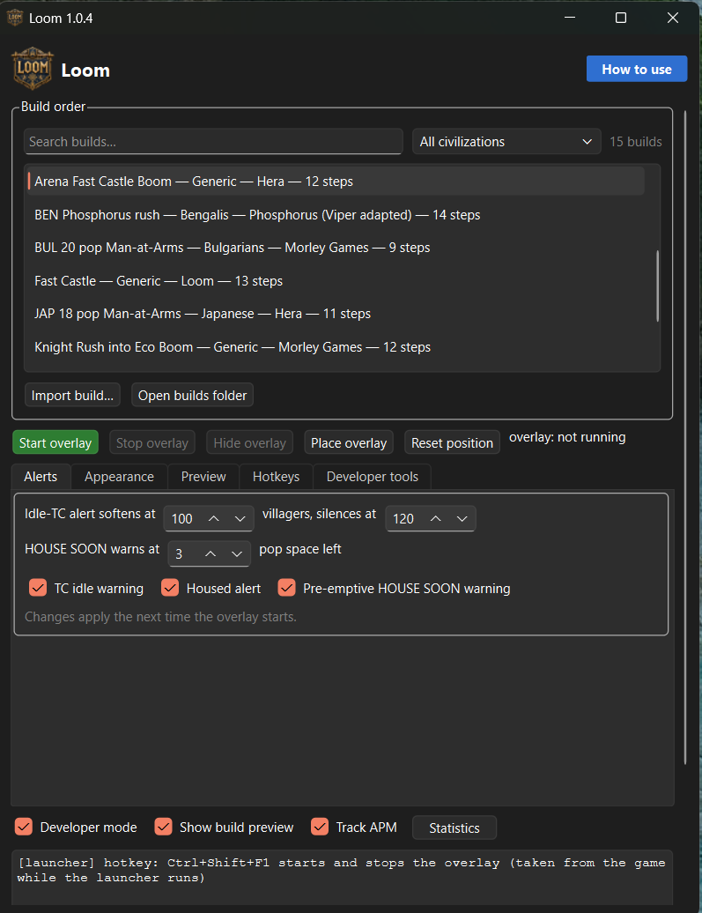
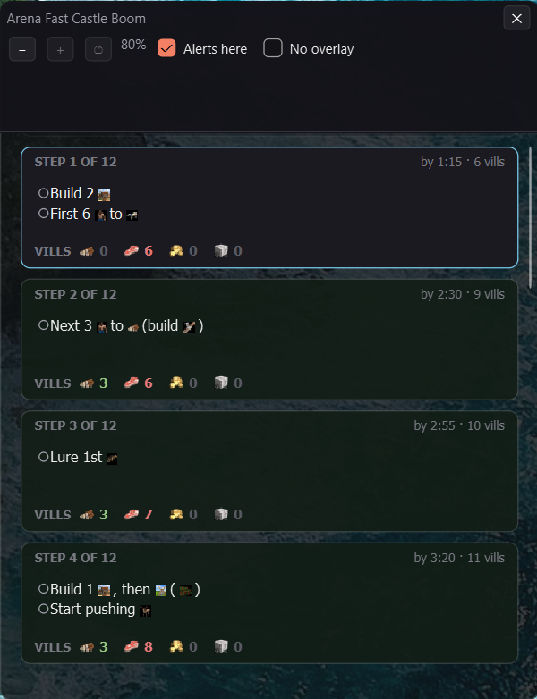
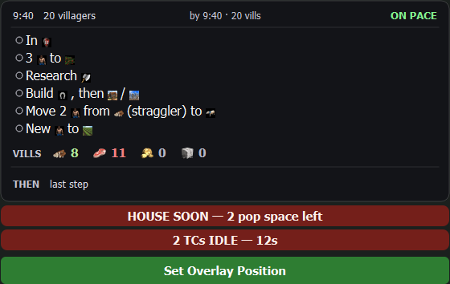

<p align="center">
  
</p>

# Loom

A live, on-screen build-order assistant for **Age of Empires II: Definitive
Edition**. Loom watches the game's HUD by screen capture, reads the **total
villager count** and the **game clock** off it several times a second, and uses
those two numbers to drive a build order — showing the step to do now, the step
after it, whether you are on pace, and how your villagers are spread across
food, wood, gold and stone versus what the build wants.

> **Loom is early software.** It reads the screen, so it meets a different
> machine in every Windows version, screen resolution, display scaling and HUD
> mod out there — and it has only been tested on a handful of them so far. If
> something does not work, please
> [open an issue](https://github.com/gwaihirf22/loom_AOE/issues); a report with
> your resolution and Windows version is genuinely the fastest way it gets
> fixed.

#### Video demo: [https://youtu.be/IjrvbCo6lIQ](https://youtu.be/IjrvbCo6lIQ) (This is only showing functionality and is not a guide of how to use this) View below for details on how to run Loom for yourself.


*Loom's panel sitting on top of a real match — the current step, whether you're
on pace, and your villagers-per-resource versus what the build wants, all read
off the HUD while you play.*

### Why "Loom"?

Forgetting to research **Loom** — the cheap Town Centre technology that stops
your villagers dying to a boar or an early rush — is one of the oldest running
jokes in the Age of Empires II community. "Did you forget Loom?" is what you say
to someone who just lost a villager they did not need to.

This tool exists so I stop forgetting Loom, and everything else in the build I
mean to do and do not. The name is the bug it was written to fix.

---


## What makes it different

Build-order overlays already exist — RTS Overlay, Border — but they are all
*manual*: you press a hotkey to advance to the next step, and they have no idea
what is happening in your game. Websites like aoecompanion need a second monitor
and do not move with your game.

Loom's novel part is that it **reads the real game state and advances itself**.
It knows you just made your seventh villager, so it shows you the seventh-villager
instruction without being told. It knows the clock says 9:05 when the build
wanted you in Feudal Age by 9:00, so it tells you that you are behind. Nobody has
to press anything.

There *are* hotkeys, and they are the exception that proves the point: they nudge
the step when a reading has drifted, and then Loom goes back to following the game
on its own after ten seconds. You can also switch following off entirely if you
would rather drive — and then the panel says **MANUAL** across the top for as long
as it lasts, because an overlay that has quietly stopped tracking your game while
looking exactly as it always does is the one thing this must never do.

It does this **without touching the game**. Loom reads pixels from the screen
and draws a window on top. It never injects into, modifies, or reads the memory
of the game process.

If that still sounds like cheating, take a breath: Loom does not click for
you, does not make you faster, and has never won a game on its own. It is a
sticky note that can read a clock. I wrote it because my attention span
mislays a build order somewhere around the fourth villager — the longer
answer is [at the end](#is-this-cheating), for anyone who wants it.

---


## Contents

- [Get Loom running](#get-loom-running) — download and play, on Windows or Linux
- [Set up the game](#set-up-the-game) — the one setting that matters, and two useful mods
- [First run](#first-run) — four things, once
- [Reading the panel](#reading-the-panel) — what the overlay is telling you
- [Hotkeys](#hotkeys) — nudging the step, and switching following off
- [Adding build orders](#adding-build-orders) — where to find them, where to put them
- [Make it yours](#make-it-yours) — size, transparency, alerts, APM
- [Statistics](#statistics) — every game, graphed
- [Which platforms it runs on](#which-platforms-it-runs-on) — Windows and Linux, and where macOS stands
- [Is this cheating?](#is-this-cheating) — no, and here is the long answer
- [Running from source](#running-from-source) — for development
- [How it works](#how-it-works) — the engineering story
- [Project layout](#project-layout) · [Acknowledgements](#acknowledgements) · [Credits](#credits)

---


## Get Loom running

There is no Python to install on either platform. Pick your OS.

### Windows

1. Download the latest
   [`Loom-x.y.z-windows.zip`](https://github.com/gwaihirf22/loom_AOE/releases/latest).
2. Unzip it anywhere you like.
3. Run `Loom.exe`.

That is the whole install. It needs **Windows 10 version 1903 or newer** and
the game. `Loom.exe` is the launcher; everything else opens from it.

### Linux

Loom is a Flatpak, so the runtime brings its own Python:

```sh
flatpak install ./Loom-x.y.z-x86_64.flatpak
flatpak run io.github.gwaihirf22.loom_AOE
```

You may have to point Loom at your Steam library if it sits outside the
usual place — one `flatpak override` command, covered in the
[Linux guide](docs/install-linux.md). Verified on Bazzite / KDE Plasma /
Wayland; the game must run in **Full screen** mode.

### If Windows objects

Loom is a small unsigned open-source program, and Windows treats every new
release of one with suspicion until enough people have run it:

- **SmartScreen** ("Windows protected your PC"): click **More info → Run
  anyway**.
- **Microsoft Defender sometimes quarantines `Loom.exe` outright** — it
  vanishes right after you extract the zip, blamed on a detection ending in
  `!ml`. That is a machine-learning false positive on a brand-new file:
  a fresh release has a hash Defender has never seen, and "unknown +
  unsigned" is enough for its heuristics. Loom is a free community project
  and is not code-signed — signing is a paid subscription, and this app
  earns nothing — so expect this on new releases until enough people have
  run them. To get the file back: **Windows Security → Virus & threat
  protection → Protection history**, find the entry naming `Loom.exe`, and
  choose **Restore** or **Allow on device**. If Defender keeps taking it,
  add the folder you unzipped Loom into to its exclusions (**Virus &
  threat protection settings → Exclusions**).

Loom never injects into the game, reads its memory, or touches the network —
it reads pixels from the screen and draws a panel on top. The full source of
every release is published right here, so none of that has to be taken on
faith.

---


## Set up the game

Two settings matter, both under **Options → Interface**:

- **HUD scale at 100%.** Loom follows the HUD at other sizes, but it reads
  best at 100% and below about 90% it may not find the HUD at all. (The
  slider tends to report 99% however it is set — that is fine.) If you
  change the scale, or switch UI mods, restart the overlay so it measures
  the new one.
- **Notification duration at its shortest.** Loom counts your Town Centres
  by reading the game's own `--Town Center Built--` line, and how long that
  line stays on screen changes the answer: the game never reprints a
  message that is still showing, and it redisplays recent history whenever
  the feed has faded. Every timing Loom uses here was measured at the
  shortest setting. A longer one is not known to be broken, it is
  **untested** — and the symptom if it goes wrong is a Town Centre counted
  twice, which shows up as an idle-TC warning that will not go away.

Loom reads the HUD at **1920x1080 and 2560x1440**, on both skins — the
clock, the villager count, the population display, the production queue and
the age crest are all checked against recorded games at both sizes. If you
play at a resolution that is not your monitor's own, the overlay can appear
to shimmer slightly; that is the display scaling the picture rather than
Loom, and playing at the native resolution or in windowed mode removes it.

> **Playing at 1920x1080? It works, but the message feed is still patchy.**
> At 1080p the game draws everything smaller, and Loom's reference images
> were originally cut at 1440p. The numbers are sorted — the clock,
> villager count and population now read at 99–100% on recorded games at
> this size. The game's own message feed ("--Barracks Built--") is much
> better than it was but still misses lines, and two things depend on it:
> the **green ticks** on the step checklist, and **counting your Town
> Centres** (which the idle-TC warning is built on). So at 1080p expect
> some items not to tick off, and the odd event to be missed. Nothing is
> wrong with what it *does* report — a missed line is a gap, never a wrong
> answer. **2560x1440 remains the fully-verified resolution**; closing the
> rest of the 1080p gap is the top item on the list.

Loom reads **the stock HUD** and **the Anne_HK Better UI mod**, and works
out which is on screen by itself when a match starts. Any other mod that
replaces the resource-bar artwork needs its own profile first — Loom says
so rather than failing silently, naming the closest skin it found.

Two mods pair well with Loom — recommended, never required:

- [Anne_HK — Better UI](https://www.ageofempires.com/mods/details/3762) is
  the layout Loom was originally built against: more room, standardised
  item locations, every read a little easier. Fully supported and
  auto-detected.
- [The transparent-UI mod](https://www.ageofempires.com/mods/details/2532)
  clears the per-civilization border artwork from around the HUD — the main
  source of reading trouble. Two honest caveats. It does not cover every
  civ, and the newest civs (whose artwork causes the most trouble) are the
  least likely to be covered yet. And what it gives with one hand it takes
  a little back with the other: terrain showing through the bar costs a
  small, measured slice of the HUD-detection score — fine on every map it
  has been tested on, but if Loom ever fails to find your HUD, this mod is
  the first thing to try turning off.

One more mod is verified to coexist with Loom:

- **Eco Upgrade Indicator** draws upgrade squares under the resource boxes
  and the villager counter. Checked against recorded games on the Anne_HK
  skin at 2560x1440: the squares land outside every band Loom reads, and
  detection, digits and the production queue all read normally with it on.
  Other skin and resolution combinations have not been measured yet.

---


## First run

Four things, once:



*The launcher: your build library with search and a civilisation filter, the
overlay controls, and the settings tabs. Everything opens from here.*

1. **Pick a build** from the list at the top of the launcher — Loom ships
   a starting library, and **Import build** adds any you find or write. The
   preview window beside it shows the whole build; during a match it
   follows along on its own. It keeps only the cards until you move the
   pointer onto it, then fades its controls back in — a window you read far
   more often than you operate. An alert band and the **manual** warning are
   the two things that never fade. The **Preview** settings tab tunes the
   look — background, card opacity, text size — and applies instantly.

   

   *The preview: every step of the build as a card, the current one lit.
   Browse it with the mouse before a match; during one it follows the game.*
2. **Place the panel.** **Place overlay** opens the real panel —
   frameless and see-through, at the transparency you will actually play
   with. It shows your selected build at its *tallest* step with both
   alert bands up, because the saved position pins the panel's top-left
   and the panel grows downward: what you want to place around is the
   biggest it will ever get, not a typical step. Drag it by the card and
   press **Set Overlay Position**, which saves the spot and closes it.
   **Esc**, or the launcher's **Close placement**, backs out saving
   nothing — so trying a corner costs you nothing. The Appearance
   sliders apply to it live. No game needed, though with one running it
   lines up exactly. **Reset position** puts it back to the game
   window's top right if it ever ends up somewhere unhelpful.

   

   *Place Overlay: the panel you will actually play with, at its fullest
   — the busiest step of the build, both alert bands, and the button
   that commits the spot.*
3. **Start the overlay** — before or during a match, either is fine. It
   waits for the game, then picks up wherever the match already is.
4. **Check the alerts.** The idle-Town-Centre and housing warnings can each
   be switched off if you would rather not see them.

### Playing without a build order

The top two entries in the build list are not builds. Pick one and Loom runs
everything except the build order — it still reads the clock, your villagers,
the production queue and the age, still raises the idle-Town-Centre and
housing alerts, and still writes a statistics file.

- **NO BUILD ORDER — Tracking and Alerts only** puts nothing on screen but the
  alert bands. While it waits for a match it shows one quiet band, so you can
  see Loom is running.
- **NO BUILD ORDER — with basic overlay** adds a small panel above them: game
  clock, villager count, villagers on each resource, your age, and whether
  your Town Centres are producing.

For the games a build order does not cover — an unusual match-up, a map you
are improvising on, or simply once you are off script. One band is missing by
nature rather than omission: **CLICK UP** means *"your build says click up
now"*, so with no build there is no now.

---


## Reading the panel


*The panel reads at a glance: the step to do now, the one after it, and a
villagers-per-resource row where each resource is its own colour. Here the build
wants 7 on wood but only 4 are there, so it is flagged; the rest match.*

- **The step is a checklist.** A build step is usually several instructions,
  so they are listed at one size with a bullet each, and the panel grows
  taller for a step with a lot of them. The deadline sits in the middle of
  the top row ("by 7:30 · 22 vills"); the **THEN** row is the step after
  this one, so you can read ahead.
- **The bullets say whether Loom knows or is only assuming.** Hollow is
  still to do. A **filled green** bullet means Loom *saw it happen* — the
  game announced it in its own message feed and Loom read that line. A
  **faded, struck-through** one means only that the build moved past that
  step, so it is assumed rather than confirmed. Items the game never
  announces — re-tasking villagers, for instance — can only ever be
  assumed.
- **The VILLS row** is your villagers per resource against what the build
  wants. A number is flagged when you are more than one villager off the
  plan.
- **The pace chip**, top right, is measured every time a villager arrives:
  green on pace, blue ahead, yellow a little behind, red behind.
- **Alert bands** appear *below* the panel, so the step you are reading
  never jumps: a flashing red band for an idle Town Centre or being housed,
  a steady amber one for the gentler warnings.
- **MANUAL** across the top means the panel has stopped following the game
  because you told it to — see [Hotkeys](#hotkeys). And when Loom cannot
  read the HUD at all it says *waiting for the game* rather than showing
  stale advice.
- **It tells you when it has stopped reading.** If the clock keeps reading
  but the villager count goes quiet, the panel says **VILLAGERS UNREAD**
  with the seconds counting up, rather than wearing a stale number as if it
  were fresh; and if Loom loses the game entirely, a soft
  **LOST SIGHT OF THE GAME** band sits above the panel until it finds it
  again. The panel keeps working the whole time — it just stops pretending.
- **An amber bullet** is an item Loom was watching for and never saw
  confirmed. It is deliberately *not* struck through: Loom does not know you
  skipped it, only that nothing announced it.

---


## Hotkeys

**Hotkeys ship switched off.** A key Loom registers is taken away from the
game for as long as Loom runs, and that should be your choice rather than a
surprise — so tick **Use hotkeys** in the launcher to switch the whole set
on. The keys below are what is waiting behind that switch, and all of them
are editable.

- **Ctrl+Shift+W** — forward one step. **Ctrl+Shift+Q** — back one step.
  These are a *correction*, not a mode: after you press one, Loom stops
  following the game for ten seconds so you can read the step, then picks
  the game back up by itself. The ten seconds is adjustable.
- **Ctrl+Shift+R** — stop following the game, or start again. This one does
  not time out: while it is off the panel says **MANUAL** across the top,
  naming the key that gets you back. A new match always returns to
  following the game.
- **Ctrl+Shift+Minus** — the **-** key — hides the panel, or brings it back.
  The launcher's **Hide overlay** button does the same thing and turns green
  while it is hidden. It is not `Ctrl+Shift+0`, which looks tidier and which
  Windows swallows before any program can see it.

When the build order finishes, the panel rests on its report card — and you
can step off it. **Ctrl+Shift+Q** goes back to the last step of the build and
keeps going from there, so you can see how it went and then read back through
what it asked for. That review does not time out, because there is no longer a
live build to drift out of sync with: the panel says **MANUAL** until you walk
forward off the last step, or press **Ctrl+Shift+R**, either of which brings
the report back.
  Hiding is not stopping: Loom keeps reading the game, recording the match
  and counting APM the whole time, and only the window goes away.
- **Ctrl+Shift+F1** — start or stop the overlay, doing what the launcher's
  Start and Stop buttons do, so the overlay can be started mid-game without
  alt-tabbing.

All of these are editable in the launcher under **Build-order hotkeys**,
and any can be left empty to switch that action off. Worth knowing: they are registered with the
operating system, so **while Loom is running, the game does not see them**
— if one clashes with a hotkey you use in Age of Empires, change it here.
Loom also says in the launcher's output when another program already owns a
combination.

---


## Adding build orders

Loom uses the format the Age of Empires II community already shares builds
in — [RTS Overlay](https://github.com/CraftySalamander/RTS_Overlay) JSON —
so **a build downloaded from the community works unchanged**.

### Get a build

- **Browse ready-made builds** at
  [buildorderguide.com](https://www.buildorderguide.com/): open a build and
  press **Export for RTS**, which gives you the build as JSON text. Paste
  it into Notepad and save it as `SomeBuild.json` (in the save dialog, set
  *Save as type* to *All files* so it does not become `.txt`).
- **Or design your own** with the
  [RTS Overlay web tool](https://rts-overlay.github.io) and save the JSON.

### Import it

Press **Import build** in the launcher and pick the file. Loom checks it,
copies it into your builds folder and selects it straight away — no
restart. If the file cannot work as a build order, Loom says why rather
than importing it; if it works but something is odd — steps out of order,
no times, icons Loom has no picture for — it says so and lets you decide.

### Find it again

The launcher lists your whole library, each row naming the build, its
civilisation, its author and how many steps it has. Type in the **search
box** to narrow the list as you go — it matches the name, the civilisation
and the author — or use the **civilisation** box beside it to see the
builds you could play as one civ. Generic builds are included there,
because they work for every civ.

Whatever you have selected always stays in the list, marked, even when it
does not match what you typed: narrowing the list should never quietly
change which build the overlay is about to run.

**Open builds folder** opens where they are kept — `%APPDATA%\Loom\builds` on
Windows. Anything dropped in there by hand appears the next time the
launcher starts, and builds kept there survive updating Loom. (The `builds`
folder inside the app works too, but a new version's zip replaces it and
takes your builds with it. Running from a clone, it is the `builds` folder
beside the code.)

Each step of a build looks like this:

```json
{
  "villager_count": 21,
  "age": 1,
  "time": "7:30",
  "resources": { "food": 14, "wood": 7, "gold": 0, "stone": 0 },
  "notes": ["Next 4 @resource/MaleVillDE.webp@ to @resource/Aoe2de_wood.webp@"]
}
```

Loom normalises this on load: `"7:30"` becomes 450 seconds and the `@...@`
icon tokens become pictures in the overlay (words, if the picture is
missing). Your file is never rewritten. Loom ships a starting library —
two builds of my own, the rest transcribed from published guides and
credited inside each file.

---


## Make it yours

Everything below lives in the launcher, and settings apply the next time
the overlay starts.

- **Overlay size** has two knobs: overall size grows the whole panel;
  text size grows only the writing (the panel gets taller, never wider, so
  bigger text does not widen its footprint on the game).
- **Overlay transparency** has two sliders. **Background** is the dark card
  behind the writing: 100% is solid, 0% removes it entirely. **Text &
  icons** fades the writing below 50% and makes it brighter and bolder
  above it — useful over bright terrain with the card thinned. A
  combination I like: background around **20%** with text at **90%** — a
  faint card with vivid writing — but it is entirely your taste. Alert
  bands always stay at full strength; they are alarms.
- **Alerts.** The idle Town Centre warning tapers as your economy matures:
  you choose the villager count where it softens and the one where it goes
  quiet — late game, an idle TC is often deliberate. **HOUSE SOON** warns
  while a house can still prevent the stall; **HOUSED** means production
  has actually hit the wall. Each family has its own switch.
- **Track APM** counts your keystrokes and clicks for the post-game graphs.
  It counts and nothing more — Loom never knows *which* key was pressed;
  the code cannot see it, by construction. Switch it off and it counts
  nothing at all.

---


## Statistics

Every game writes one JSON file: the build-completion report, a post-game
summary (game length, peak villagers, villager deaths with raid
attribution, Town Centre efficiency, housed time, when each unit and
technology first appeared), and a per-second timeline. The **Statistics**
button opens past games with three tabs — the build report, the summary,
and graphs of villagers, pace and APM.

Once a match has finished, Loom also finds the **recorded game** the match
wrote and reads it, so the statistics can be checked against what the game was
actually told to do rather than only against what Loom managed to see. This
happens after the game and never during it — see
[On fair play](#is-this-cheating) for why that boundary exists and what
enforces it.

---


## Which platforms it runs on

| | Linux | Windows | macOS |
|---|---|---|---|
| Reading the HUD | ✅ | ✅ | ⚠️ ~1–2s behind |
| Overlay | ✅ | ✅ | ⚠️ CrossOver yes, Feral windowed only |
| Statistics + graphs | ✅ | ✅ | ✅ |
| APM tracking | ✅ | ✅ | ❌ not yet |
| Packaged install | ✅ Flatpak | ✅ zip with `.exe` | ❌ source only |

Windows and Linux both have a one-step install; see
[above](#get-loom-running). The per-OS guides carry the details — display
modes, where settings live, what is not supported yet:

- **[Windows](docs/install-windows.md)** — Windows 10 1903+; also covers
  running from source.
- **[Linux](docs/install-linux.md)** — the Flatpak, and the one permission
  you may need to grant it. XWayland, Proton, **Full screen** mode.
  Verified on Bazzite / KDE Plasma / Wayland.
- **[macOS](docs/install-macos.md)** — the Windows build under CrossOver
  works, fullscreen included; the native Feral port is paused and
  windowed-only. Read the limitations first.

The detail behind every cell, and why, is in
[docs/platform-support.md](docs/platform-support.md).

---


## Is this cheating?

It is a fair question and I have thought about it a lot, so here is the whole
answer in one place.

**Loom never touches the game.** It reads pixels off the screen and draws a
window on top. It does not inject into the game, modify it, or read its memory,
and it sends it no input — no clicks, no queued units, no hotkeys pressed on
your behalf. Every action in your game is still one you took.

**It shows you nothing that is not already on your screen.** It knows you have
seven villagers because the number 7 is on your HUD. It knows you are behind
because the clock is too. Even the idle-Town-Centre alert is read off the game's
own production queue, the widget already sitting in the corner. If Loom knows
something, you could have known it by looking.

**That holds for the whole match, without exception.** The only thing on the
panel that was not already on your screen is the build order itself — your own
notes, which you brought with you, and which you could just as well have had on
a second monitor or a printed sheet.

**The post-game summary is a different thing, and after the game is a different
place.** Once a match ends, Loom reads the recorded game it wrote, so the
statistics can be checked against what the game was actually told to do rather
than only against what Loom managed to see. That summary can therefore show you
things you did not see during the match, your opponent included — because it is
reading a replay, and watching a replay after a game is something the game
itself offers you.

The line between the two is the whole point, and it is enforced rather than
promised. A recorded game holds every command *both* players issued, fog
included, so reading a live one would not be a better reader — it would be a
different program. **Loom refuses to open a recorded game the match is still
writing**, and refuses it where the file is actually opened, so every route
inherits the rule: the automatic finder, the *Add recorded game* picker, and
anything added later.

There are two refusals, because they mean different things. `rec.aoe2record` is
the game being played right now, and Loom says so. A record whose file has not
settled yet is one the game is still finishing, and Loom says *try again in a
few seconds*, which is a wait rather than a wall. Both are distinct from "this
file is broken" — declining to look is not the same as failing to read, and a
player deserves to be told which one happened.

So what it gives you is **attention, not information** — it notices the thing
you could see and did not, because you were watching your scout. That is the
honest description, and it is also why the panel is not the shortcut people
assume. Reading it and acting on it while you scout, wall and react is its own
skill, and it is harder in a real game than it looks in a video.

**It only covers the opening.** A build order runs out somewhere around your
eighteenth to thirtieth villager. After that you get raided, you scout something
that forces a change, and you are off script — and Loom has nothing to say
about any of it. It helps with the most memorisable and least interesting part
of the game.

**What it replaces is a second monitor.** Players have kept build orders on a
second screen, a phone or a printed sheet for as long as the game has existed.
Loom puts the same page on the same screen and keeps your place in it. Not
everyone has a second monitor; everyone has the one.

### On the rules

Microsoft's [Code of Conduct](https://www.ageofempires.com/code-of-conduct/)
prohibits **tampering with the game**, and staying clear of that line is the
whole architecture above. The [Xbox Community
Standards](https://www.xbox.com/en-US/legal/community-standards) prohibit
specialized software used **to gain unfair advantage** — a conditional, and one
Loom does not meet on any reading that does not also catch Discord, rating
overlays, aoecompanion, or the UI-readability mods the game's own mod browser
hands out.

I am not claiming Microsoft has blessed this; nobody has asked them, and there
is no ruling to point at. I am claiming something narrower: Loom does not touch
the game, sends it no input, and shows you nothing that is not already on your
screen. If World's Edge ever tells me that is over the line, I will take it down.

Tournaments are a separate matter. Organisers set their own rules and are free
to forbid any external tool. If you are playing in one, ask before you run this.

---


## Running from source

For development, or the terminal tools. Everything that is not capture or
overlay — the build-order engine, pace, the queue reader, notifications,
statistics — is plain Python and OpenCV and behaves identically everywhere.

```bash
git clone https://github.com/gwaihirf22/loom_AOE.git
cd loom_AOE
python3 -m venv .venv          # Windows: py -m venv .venv
source .venv/bin/activate      # Windows: .\.venv\Scripts\Activate.ps1
pip install -r requirements.txt

python loom_app.py             # the launcher: pick a build, start the overlay
python loom_overlay.py         # the overlay directly, over a running game
python loom_coach.py           # the same coaching logic, in a terminal
python loom_read.py            # just the two HUD numbers, for checking
```

Every front end also runs without the game — `loom_overlay.py --demo`
replays a whole match on your desktop, and `loom_coach.py --simulate` does
the same in a terminal — and the test suite runs anywhere with
`python -m pytest tests/ -q`. The per-OS guides above cover the platform
details, including the Windows "Python was not found" trap.

---


## How it works

Loom is a pipeline: **capture pixels → find the numbers → read the digits →
filter out mistakes → decide what to show**. The first screenshot attempt
came back pure black (Wayland does not let one program read another's
pixels — the way in is the game's own XWayland window); the digits are read
by matching ten reference images because the HUD font never changes; and no
reading is ever guessed, because a wrong villager count silently
desynchronises everything while an admitted gap does not.

The full engineering story — the anchor search, the HUD-skin detection, the
filters and the bugs they pin down, the click-through discovery, and the
design decisions worth calling out — is in
**[docs/how-it-works.md](docs/how-it-works.md)**.

---


## Project layout

```
loom_app.py             the launcher (start here)
loom_overlay.py         the overlay (main entry point)
loom_coach.py           the same coaching logic, in a terminal
loom_read.py            raw readout of the two HUD numbers (diagnostic)
loom/                   everything that gets imported
  paths.py              file locations: shipped assets, and the player's own
  capture/              reading pixels out of the game window, per OS
    x11.py              Linux, macos.py macOS, windows.py Windows
  hud.py                HUD skins: which templates and offsets belong together
  anchor.py             finding the HUD by template matching
  digits.py             digit recognition by template matching
  filters.py            rejecting misreads
  session.py            game started / resumed / tracking lost
  reader.py             the whole read pipeline behind one class
  build_order.py        loading builds, current step, pace inputs
  buildcheck.py         will an imported file work as a build? said at import
  steplayout.py         how many item rows a step needs, and how big
  checklist.py          which of a step's items are done, and how we know
  age.py                the age crest read off the HUD, and when ages arrived
  pace.py               how far behind the build order you are
  resources.py          villagers-per-resource, read off the HUD
  queue.py              reading the global production queue off the HUD
  production.py         believed production state (idle TCs, housed)
  alerts.py             how loudly each production event deserves
  notifications.py      the game's own event lines, read as phrases
  glyphs.py             the notification font, read letter by letter
  report.py             the build-complete report (the payoff screen)
  gamestats.py          per-game statistics, one JSON file per match
  debuglog.py           one line per poll, on disk: raw readings beside believed
  apm.py                aligning APM buckets to the game clock
  overlay.py            the on-screen panel
  passthrough.py        asks the OS whether the overlay really is click-through
  launcher.py           the launcher window
  browser.py            the launcher's build preview: a stack of step cards
  statsview.py          the statistics window: past games, tabs, graphs
  follow.py             is the panel following the game, and where it looks
  hotkeys/              registering global hotkeys, per OS
  statefeed.py          overlay state as sentinel lines on its own stdout
  stopline.py           the launcher's "please stop", back down on stdin
  runner.py             running the other Loom programs as children
  config.py             saved settings: overlay position, alerts, build
tools/                  scripts, never imported - run directly or with -m.
                        Mostly development, but NOT only: apm_counter.py
                        ships and counts APM on Linux
  grab_frames.py        screenshot grabber: run_<time>_<skin>[_<label>]/
  index_captures.py     rewrites captures/INDEX.md from the folder names
  capture_smoketest.py  the Wayland capture test (documents why mss is
                        unused - and is the only thing that imports it,
                        which is why mss is a dev-only dependency)
  overlay_test.py       does always-on-top survive a fullscreen game, and is
                        the panel really click-through?
  apm_counter.py        counts keys and clicks per bucket - never which key
  windows_probe.py      which Windows capture path actually returns pixels
  replay_queue.py       replays captured frames through the full stack
  tc_debug.py           live view of what the Town Centre tracker believes
  build_queue_templates.py  cuts queue icon templates from game artwork
templates/              reference images used for matching
  pop_icon.png          the population icon, as the Anne_HK mod draws it
  stock/                the same anchors as the unmodded game draws them
  digits/               labelled 0-9 glyphs (shared: it is the game's font)
  queue/                unit icons for reading the production queue
builds/                 build orders as JSON
master_aoe2_images/     the build-step icon library (game art - see below)
stats/                  per-game statistics files (gitignored)
captures/               frames grabbed while playing (gitignored); INDEX.md
                        is generated, so rename a folder to describe it
images/                 resource icons for overlay
tests/                  the test suite
packaging/              what each OS needs to ship Loom as an app
  linux/                the Flatpak: manifest, AppStream metainfo, .desktop
                        entry, icon, and the README arguing each sandbox
                        permission. Installed from source, not frozen
docs/                   install guides, platform support, how it works,
                        and the map of the modules (architecture.md)
CHANGELOG.md            version history; 1.0.0 is the Windows release
```

Anything under `loom/` is imported; anything under `tools/` is only run
directly, never imported by the app. That is a rule about direction, not
about shipping — `tools/apm_counter.py` is part of the Linux package and is
spawned as `python -m tools.apm_counter` while you play. Paths come from
`loom/paths.py`, derived from the source location rather than the working
directory, so Loom runs from anywhere.

---


## Acknowledgements

Loom leans on work the Age of Empires II community has already done. It reads the
game and draws a panel; almost everything it knows about *what a good opening
looks like* came from elsewhere.

**[RTS Overlay](https://github.com/CraftySalamander/RTS_Overlay)** by
CraftySalamander (GPL-3.0) — Loom uses its build-order JSON format. Choosing it
over a format of my own is why community builds play in Loom unchanged. I
implemented the format by reading published build orders; no code from that
project is used here.

**[rtsbuilds](https://github.com/CraftySalamander/rtsbuilds)** (GPL-3.0) — the
library of community build orders in that format, which proved the
interoperability really works. Those builds are not redistributed here.

**Hera** — the Arena Fast Castle Boom credited to them in that library was the
build I tested against. Its source video: [https://youtu.be/JsTNM7j6fs4](https://youtu.be/JsTNM7j6fs4)

**[buildorderguide.com](https://www.buildorderguide.com/)** and
**[Sage of Empires](https://github.com/Mulliman/sage-of-empires)** — where many
community builds are written, and the earlier helper whose schema shaped Loom's
first draft before I moved to the RTS Overlay format.

Age of Empires II: Definitive Edition is developed by Forgotten Empires and
published by Xbox Game Studios. Loom is an unofficial fan-made tool, not
affiliated with or endorsed by them.

The build-step icons in `master_aoe2_images/` are game art. Age of
Empires II © Microsoft Corporation. Loom was created under Microsoft's
["Game Content Usage Rules"](https://www.xbox.com/en-US/developers/rules)
using assets from Age of Empires II, and it is not endorsed by or
affiliated with Microsoft.

---


## Licence

Loom is released under the **[GNU General Public License v3](LICENSE)**.

That is not a preference, and it is worth saying why so nobody has to work it
out again. Loom draws its window with PyQt6, which is licensed GPL-3.0-only. A
distributed binary bundling PyQt6 is a combined work, and GPL v3 is what that
combination requires — picking a permissive licence while shipping PyQt6 inside
the `.exe` would be a violation rather than a choice. The only route to a
permissive licence runs through replacing PyQt6 with PySide6, which is LGPL, and
that migration has not been done.

Two things GPL v3 does *not* prevent, since both get assumed: donations are
entirely unaffected, and selling copies is expressly permitted. What it requires
is that whoever receives the program can also receive its source and the same
rights.

Every bundled dependency and its licence is listed in [NOTICE](NOTICE). One
detail there is easy to lose: OpenCV is Apache 2.0, which is compatible with GPL
**v3** but not v2 — so this project cannot move back to v2.

## Credits

Built by **Paul Blake**. Loom began as a CS50 final project, and outgrew
the course before the course finished.

I used Anthropic's Claude throughout for syntax, code organisation,
debugging and review — cited at the top of every source file. The design,
architecture and direction are my own: every significant choice came out of
testing the tool against a real game and deciding what the results meant.
