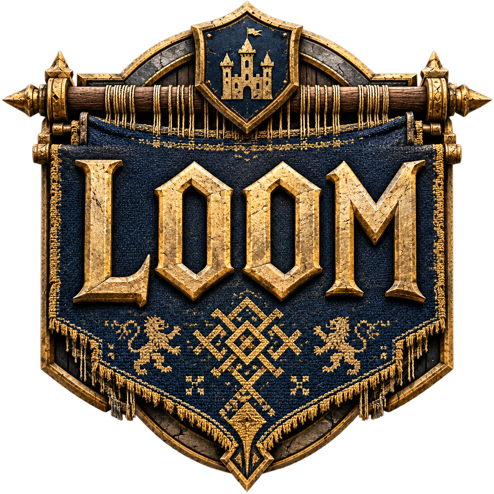
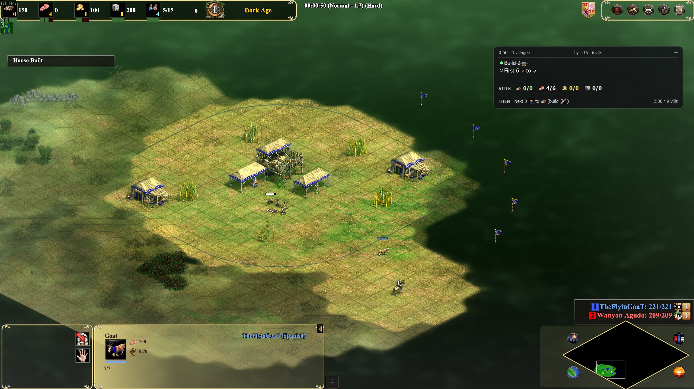
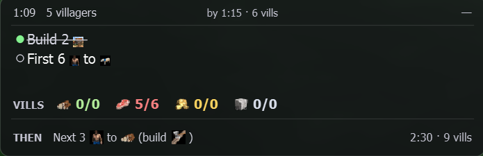

<p align="center">
  
</p>

# Loom

A live, on-screen build-order assistant for **Age of Empires II: Definitive
Edition**. Loom watches the game's HUD by screen capture, reads the **total
villager count** and the **game clock** off it several times a second, and uses
those two numbers to drive a build order — showing the step to do now, the step
after it, whether you are on pace, and how your villagers are spread across
food, wood, gold and stone versus what the build wants.

#### Video demo: [https://youtu.be/IjrvbCo6lIQ](https://youtu.be/IjrvbCo6lIQ) (This is only showing functionality and is not a guide of how to use this) View below for details on how to run Loom for yourself.



*Loom's panel sitting on top of a real match — the current step, whether you're
on pace, and your villagers-per-resource versus what the build wants, all read
off the HUD while you play.*

### Why "Loom"?

Forgetting to research **Loom** — the cheap Town Centre technology that stops
your villagers dying to a boar or an early rush — is one of the oldest running
jokes in the Age of Empires II community. "Did you forget Loom?" is what you say
to someone who just lost a villager they did not need to.

This tool exists so I stop forgetting Loom, and everything else in the build I
mean to do and do not. The name is the bug it was written to fix.

---


## What makes it different

Build-order overlays already exist — RTS Overlay, Border — but they are all
*manual*: you press a hotkey to advance to the next step, and they have no idea
what is happening in your game. Websites like aoecompanion need a second monitor
and do not move with your game.

Loom's novel part is that it **reads the real game state and advances itself**.
It knows you just made your seventh villager, so it shows you the seventh-villager
instruction without being told. It knows the clock says 9:05 when the build
wanted you in Feudal Age by 9:00, so it tells you that you are behind. Nobody has
to press anything.

There *are* hotkeys, and they are the exception that proves the point: they nudge
the step when a reading has drifted, and then Loom goes back to following the game
on its own after ten seconds. You can also switch following off entirely if you
would rather drive — and then the panel says **MANUAL** across the top for as long
as it lasts, because an overlay that has quietly stopped tracking your game while
looking exactly as it always does is the one thing this must never do.

It does this **without touching the game**. Loom reads pixels from the screen
and draws a window on top. It never injects into, modifies, or reads the memory
of the game process — so it is not a cheat and cannot be mistaken for one.

---


## Contents

- [Get Loom running (Windows)](#get-loom-running-windows) — download, unzip, play
- [Set up the game](#set-up-the-game) — the one setting that matters, and two useful mods
- [First run](#first-run) — four things, once
- [Reading the panel](#reading-the-panel) — what the overlay is telling you
- [Hotkeys](#hotkeys) — nudging the step, and switching following off
- [Adding build orders](#adding-build-orders) — where to find them, where to put them
- [Make it yours](#make-it-yours) — size, transparency, alerts, APM
- [Statistics](#statistics) — every game, graphed
- [Which platforms it runs on](#which-platforms-it-runs-on) — Linux and macOS too
- [Running from source](#running-from-source) — for development
- [How it works](#how-it-works) — the engineering story
- [Project layout](#project-layout) · [Acknowledgements](#acknowledgements) · [Credits](#credits)

---


## Get Loom running (Windows)

1. Download the latest
   [`Loom-x.y.z-windows.zip`](https://github.com/gwaihirf22/loom_AOE/releases/latest).
2. Unzip it anywhere you like.
3. Run `Loom.exe`.

That is the whole install — no Python, nothing else to set up. It needs
**Windows 10 version 1903 or newer** and the game. `Loom.exe` is the
launcher; everything else opens from it.

### If Windows objects

Loom is a small unsigned open-source program, and Windows treats every new
release of one with suspicion until enough people have run it:

- **SmartScreen** ("Windows protected your PC"): click **More info → Run
  anyway**.
- **Microsoft Defender sometimes quarantines `Loom.exe` outright** — it
  vanishes right after you extract the zip, blamed on a detection ending in
  `!ml`. That is a machine-learning false positive on a brand-new file:
  a fresh release has a hash Defender has never seen, and "unknown +
  unsigned" is enough for its heuristics. Loom is a free community project
  and is not code-signed — signing is a paid subscription, and this app
  earns nothing — so expect this on new releases until enough people have
  run them. To get the file back: **Windows Security → Virus & threat
  protection → Protection history**, find the entry naming `Loom.exe`, and
  choose **Restore** or **Allow on device**. If Defender keeps taking it,
  add the folder you unzipped Loom into to its exclusions (**Virus &
  threat protection settings → Exclusions**).

Loom never injects into the game, reads its memory, or touches the network —
it reads pixels from the screen and draws a panel on top. The full source of
every release is published right here, so none of that has to be taken on
faith.

---


## Set up the game

One setting matters, under **Options → Interface**:

- **HUD scale at 100%.** Loom follows the HUD at other sizes, but it reads
  best at 100% and below about 90% it may not find the HUD at all. (The
  slider tends to report 99% however it is set — that is fine.) If you
  change the scale, or switch UI mods, restart the overlay so it measures
  the new one.

Loom reads **the stock HUD** and **the Anne_HK Better UI mod**, and works
out which is on screen by itself when a match starts. Any other mod that
replaces the resource-bar artwork needs its own profile first — Loom says
so rather than failing silently, naming the closest skin it found.

Two mods pair well with Loom — recommended, never required:

- [Anne_HK — Better UI](https://www.ageofempires.com/mods/details/3762) is
  the layout Loom was originally built against: more room, standardised
  item locations, every read a little easier. Fully supported and
  auto-detected.
- [The transparent-UI mod](https://www.ageofempires.com/mods/details/2532)
  clears the per-civilization border artwork from around the HUD — the main
  source of reading trouble. One honest caveat: it does not cover every
  civ, and the newest civs (whose artwork causes the most trouble) are the
  least likely to be covered yet.

---


## First run

Four things, once:

1. **Pick a build** at the top of the launcher. The preview window beside
   it shows the whole build; during a match it follows along on its own.
2. **Place the panel.** **Place overlay** opens it as a draggable window:
   drag it where you want it, close it, and the spot is saved — no game
   needed, though with one running it lines up exactly. **Reset position**
   puts it back in the top-right corner if it ever ends up somewhere
   unhelpful.
3. **Start the overlay** — before or during a match, either is fine. It
   waits for the game, then picks up wherever the match already is.
4. **Check the alerts.** The idle-Town-Centre and housing warnings can each
   be switched off if you would rather not see them.

---


## Reading the panel



*The panel reads at a glance: the step to do now, the one after it, and a
villagers-per-resource row where each resource is its own colour. Here the build
wants 7 on wood but only 4 are there, so it is flagged; the rest match.*

- **The big line** is the step to do now, with its details beneath and its
  deadline to the right ("by 7:30 · 22 vills"). The **THEN** row underneath
  is the step after it, so you can read ahead.
- **The VILLS row** is your villagers per resource against what the build
  wants. A number is flagged when you are more than one villager off the
  plan.
- **The pace chip**, top right, is measured every time a villager arrives:
  green on pace, blue ahead, yellow a little behind, red behind.
- **Alert bands** appear *below* the panel, so the step you are reading
  never jumps: a flashing red band for an idle Town Centre or being housed,
  a steady amber one for the gentler warnings.
- **MANUAL** across the top means the panel has stopped following the game
  because you told it to — see [Hotkeys](#hotkeys). And when Loom cannot
  read the HUD at all it says *waiting for the game* rather than showing
  stale advice.

---


## Hotkeys

- **Ctrl+Shift+W** — forward one step. **Ctrl+Shift+Q** — back one step.
  These are a *correction*, not a mode: after you press one, Loom stops
  following the game for ten seconds so you can read the step, then picks
  the game back up by itself. The ten seconds is adjustable.
- **Ctrl+Shift+R** — stop following the game, or start again. This one does
  not time out: while it is off the panel says **MANUAL** across the top,
  naming the key that gets you back. A new match always returns to
  following the game.
- An optional **start/stop overlay** key does what the launcher's Start and
  Stop buttons do, so the overlay can be started mid-game without
  alt-tabbing. It ships unbound; give it keys in the launcher to switch it
  on.

All of these are editable in the launcher under **Build-order hotkeys**,
any can be left empty to switch that action off, and one **Use hotkeys**
switch covers them all. Worth knowing: they are registered with the
operating system, so **while Loom is running, the game does not see them**
— if one clashes with a hotkey you use in Age of Empires, change it here.
Loom also says in the launcher's output when another program already owns a
combination.

---


## Adding build orders

Loom uses the format the Age of Empires II community already shares builds
in — [RTS Overlay](https://github.com/CraftySalamander/RTS_Overlay) JSON —
so **a build downloaded from the community works unchanged**:

- **Browse ready-made builds** at
  [buildorderguide.com](https://www.buildorderguide.com/): open a build and
  press **Export for RTS**, which gives you the build as JSON text. Paste
  it into Notepad and save it as `SomeBuild.json` (in the save dialog, set
  *Save as type* to *All files* so it does not become `.txt`).
- **Or design your own** with the
  [RTS Overlay web tool](https://rts-overlay.github.io) and save the JSON.

Then put the file where Loom looks:

- **Best: `%APPDATA%\Loom\builds`** — create the folder if it is not there.
  (Paste `%APPDATA%\Loom` into the File Explorer address bar to jump
  straight to it.) Builds here survive updating Loom.
- The `builds` folder inside the app (`Loom\_internal\builds`, next to the
  shipped build) works too — but replacing the app folder with a new
  version's zip takes your builds with it, which is why `%APPDATA%` is the
  better home.
- Running from a clone: the `builds` folder beside the code.

The launcher lists every build it finds at its next start, each row showing
the build's own name, civilisation, author and step count.

Each step of a build looks like this:

```json
{
  "villager_count": 21,
  "age": 1,
  "time": "7:30",
  "resources": { "food": 14, "wood": 7, "gold": 0, "stone": 0 },
  "notes": ["Next 4 @resource/MaleVillDE.webp@ to @resource/Aoe2de_wood.webp@"]
}
```

Loom normalises this on load: `"7:30"` becomes 450 seconds and the `@...@`
icon tokens become pictures in the overlay (words, if the picture is
missing). Your file is never rewritten. The build shipped with Loom is my
own, with timings modelled on standard villager production; community
builds are GPL-licensed and are not redistributed here.

---


## Make it yours

Everything below lives in the launcher, and settings apply the next time
the overlay starts.

- **Overlay size** has two knobs: overall size grows the whole panel;
  text size grows only the writing (the panel gets taller, never wider, so
  bigger text does not widen its footprint on the game).
- **Overlay transparency** has two sliders. **Background** is the dark card
  behind the writing: 100% is solid, 0% removes it entirely. **Text &
  icons** fades the writing below 50% and makes it brighter and bolder
  above it — useful over bright terrain with the card thinned. A
  combination I like: background around **20%** with text at **90%** — a
  faint card with vivid writing — but it is entirely your taste. Alert
  bands always stay at full strength; they are alarms.
- **Alerts.** The idle Town Centre warning tapers as your economy matures:
  you choose the villager count where it softens and the one where it goes
  quiet — late game, an idle TC is often deliberate. **HOUSE SOON** warns
  while a house can still prevent the stall; **HOUSED** means production
  has actually hit the wall. Each family has its own switch.
- **Track APM** counts your keystrokes and clicks for the post-game graphs.
  It counts and nothing more — Loom never knows *which* key was pressed;
  the code cannot see it, by construction. Switch it off and it counts
  nothing at all.

---


## Statistics

Every game writes one JSON file: the build-completion report, a post-game
summary (game length, peak villagers, villager deaths with raid
attribution, Town Centre efficiency, housed time, when each unit and
technology first appeared), and a per-second timeline. The **Statistics**
button opens past games with three tabs — the build report, the summary,
and graphs of villagers, pace and APM.

---


## Which platforms it runs on

| | Linux | Windows | macOS |
|---|---|---|---|
| Reading the HUD | ✅ | ✅ | ⚠️ ~1–2s behind |
| Overlay | ✅ | ✅ | ❌ not over fullscreen |
| Statistics + graphs | ✅ | ✅ | ✅ |
| APM tracking | ✅ | ✅ | ❌ not yet |

On Windows, [the zip above](#get-loom-running-windows) is the install. The
per-OS guides carry the details — display modes, where settings live, what
is not supported yet:

- **[Windows](docs/install-windows.md)** — Windows 10 1903+; also covers
  running from source.
- **[Linux](docs/install-linux.md)** — XWayland, Proton, **Full screen**
  mode. Verified on Bazzite / KDE Plasma / Wayland.
- **[macOS](docs/install-macos.md)** — paused and known-degraded; read the
  limitations first.

The detail behind every cell, and why, is in
[docs/platform-support.md](docs/platform-support.md).

---


## Running from source

For development, or the terminal tools. Everything that is not capture or
overlay — the build-order engine, pace, the queue reader, notifications,
statistics — is plain Python and OpenCV and behaves identically everywhere.

```bash
git clone https://github.com/gwaihirf22/loom_AOE.git
cd loom_AOE
python3 -m venv .venv          # Windows: py -m venv .venv
source .venv/bin/activate      # Windows: .\.venv\Scripts\Activate.ps1
pip install -r requirements.txt

python loom_app.py             # the launcher: pick a build, start the overlay
python loom_overlay.py         # the overlay directly, over a running game
python loom_coach.py           # the same coaching logic, in a terminal
python loom_read.py            # just the two HUD numbers, for checking
```

Every front end also runs without the game — `loom_overlay.py --demo`
replays a whole match on your desktop, and `loom_coach.py --simulate` does
the same in a terminal — and the test suite runs anywhere with
`python -m pytest tests/ -q`. The per-OS guides above cover the platform
details, including the Windows "Python was not found" trap.

---


## How it works

Loom is a pipeline: **capture pixels → find the numbers → read the digits →
filter out mistakes → decide what to show**. The first screenshot attempt
came back pure black (Wayland does not let one program read another's
pixels — the way in is the game's own XWayland window); the digits are read
by matching ten reference images because the HUD font never changes; and no
reading is ever guessed, because a wrong villager count silently
desynchronises everything while an admitted gap does not.

The full engineering story — the anchor search, the HUD-skin detection, the
filters and the bugs they pin down, the click-through discovery, and the
design decisions worth calling out — is in
**[docs/how-it-works.md](docs/how-it-works.md)**.

---


## Project layout

```
loom_app.py             the launcher (start here)
loom_overlay.py         the overlay (main entry point)
loom_coach.py           the same coaching logic, in a terminal
loom_read.py            raw readout of the two HUD numbers (diagnostic)
loom/                   everything that gets imported
  paths.py              file locations: shipped assets, and the player's own
  capture/              reading pixels out of the game window, per OS
    x11.py              Linux, macos.py macOS, windows.py Windows
  hud.py                HUD skins: which templates and offsets belong together
  anchor.py             finding the HUD by template matching
  digits.py             digit recognition by template matching
  filters.py            rejecting misreads
  session.py            game started / resumed / tracking lost
  reader.py             the whole read pipeline behind one class
  build_order.py        loading builds, current step, pace inputs
  pace.py               how far behind the build order you are
  resources.py          villagers-per-resource, read off the HUD
  queue.py              reading the global production queue off the HUD
  production.py         believed production state (idle TCs, housed)
  alerts.py             how loudly each production event deserves
  notifications.py      the game's own event lines, read as phrases
  glyphs.py             the notification font, read letter by letter
  report.py             the build-complete report (the payoff screen)
  gamestats.py          per-game statistics, one JSON file per match
  apm.py                aligning APM buckets to the game clock
  overlay.py            the on-screen panel
  passthrough.py        asks the OS whether the overlay really is click-through
  launcher.py           the launcher window
  browser.py            the launcher's build preview: a stack of step cards
  statsview.py          the statistics window: past games, tabs, graphs
  follow.py             is the panel following the game, and where it looks
  hotkeys/              registering global hotkeys, per OS
  statefeed.py          overlay state as sentinel lines on its own stdout
  stopline.py           the launcher's "please stop", back down on stdin
  runner.py             running the other Loom programs as children
  config.py             saved settings: overlay position, alerts, build
tools/                  development scripts, never imported
  grab_frames.py        screenshot grabber: run_<time>_<skin>[_<label>]/
  index_captures.py     rewrites captures/INDEX.md from the folder names
  capture_smoketest.py  the Wayland capture test (documents why mss is unused)
  overlay_test.py       does always-on-top survive a fullscreen game, and is
                        the panel really click-through?
  apm_counter.py        counts keys and clicks per bucket - never which key
  windows_probe.py      which Windows capture path actually returns pixels
  replay_queue.py       replays captured frames through the full stack
  tc_debug.py           live view of what the Town Centre tracker believes
  build_queue_templates.py  cuts queue icon templates from game artwork
templates/              reference images used for matching
  pop_icon.png          the population icon, as the Anne_HK mod draws it
  stock/                the same anchors as the unmodded game draws them
  digits/               labelled 0-9 glyphs (shared: it is the game's font)
  queue/                unit icons for reading the production queue
builds/                 build orders as JSON
master_aoe2_images/     the build-step icon library (game art - see below)
stats/                  per-game statistics files (gitignored)
captures/               frames grabbed while playing (gitignored); INDEX.md
                        is generated, so rename a folder to describe it
images/                 resource icons for overlay
tests/                  the test suite
docs/                   install guides, platform support, how it works
CHANGELOG.md            version history; 1.0.0 is the Windows release
```

Anything under `loom/` is imported; anything under `tools/` is only run
directly. Paths come from `loom/paths.py`, derived from the source location
rather than the working directory, so Loom runs from anywhere.

---


## Acknowledgements

Loom leans on work the Age of Empires II community has already done. It reads the
game and draws a panel; almost everything it knows about *what a good opening
looks like* came from elsewhere.

**[RTS Overlay](https://github.com/CraftySalamander/RTS_Overlay)** by
CraftySalamander (GPL-3.0) — Loom uses its build-order JSON format. Choosing it
over a format of my own is why community builds play in Loom unchanged. I
implemented the format by reading published build orders; no code from that
project is used here.

**[rtsbuilds](https://github.com/CraftySalamander/rtsbuilds)** (GPL-3.0) — the
library of community build orders in that format, which proved the
interoperability really works. Those builds are not redistributed here.

**Hera** — the Arena Fast Castle Boom credited to them in that library was the
build I tested against. Its source video: [https://youtu.be/JsTNM7j6fs4](https://youtu.be/JsTNM7j6fs4)

**[buildorderguide.com](https://www.buildorderguide.com/)** and
**[Sage of Empires](https://github.com/Mulliman/sage-of-empires)** — where many
community builds are written, and the earlier helper whose schema shaped Loom's
first draft before I moved to the RTS Overlay format.

Age of Empires II: Definitive Edition is developed by Forgotten Empires and
published by Xbox Game Studios. Loom is an unofficial fan-made tool, not
affiliated with or endorsed by them.

The build-step icons in `master_aoe2_images/` are game art. Age of
Empires II © Microsoft Corporation. Loom was created under Microsoft's
["Game Content Usage Rules"](https://www.xbox.com/en-US/developers/rules)
using assets from Age of Empires II, and it is not endorsed by or
affiliated with Microsoft.

---


## Credits

Built by **Paul Blake**. Loom began as a CS50 final project, and outgrew
the course before the course finished.

I used Anthropic's Claude throughout for syntax, code organisation,
debugging and review — cited at the top of every source file. The design,
architecture and direction are my own: every significant choice came out of
testing the tool against a real game and deciding what the results meant.
