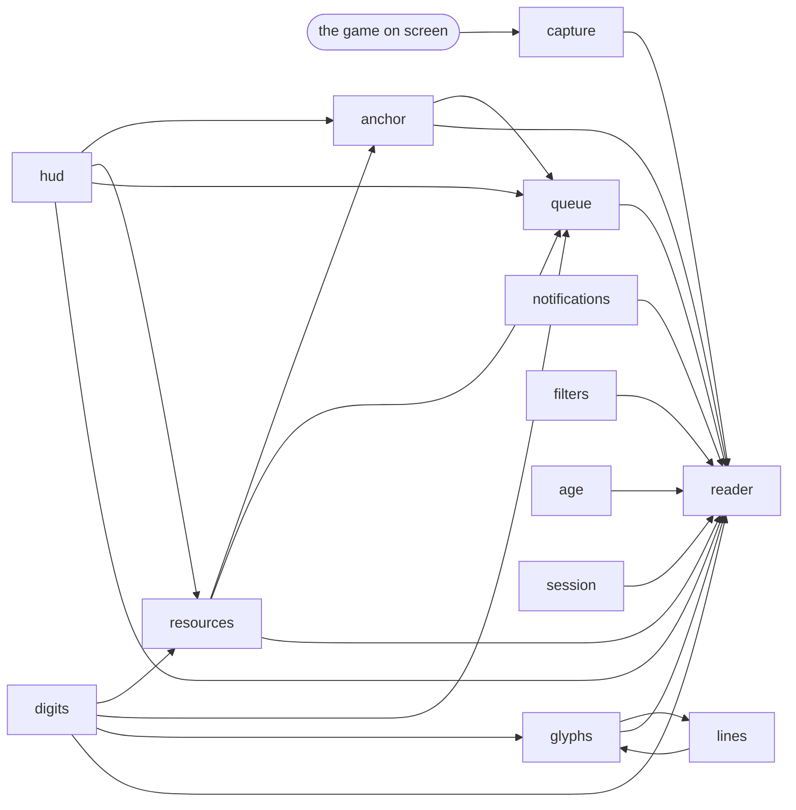
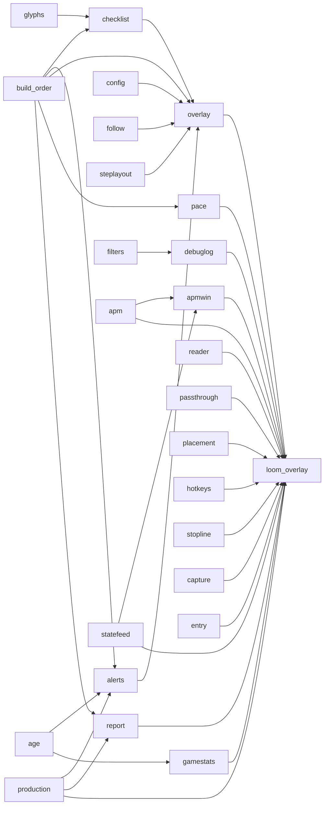
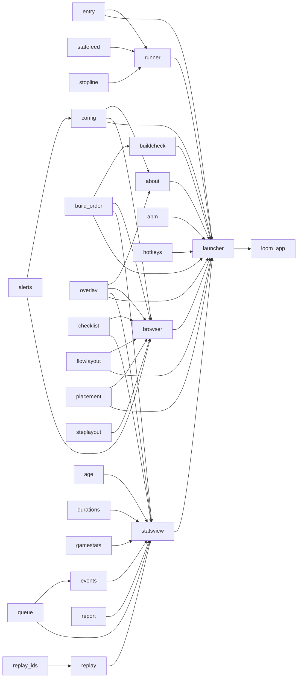
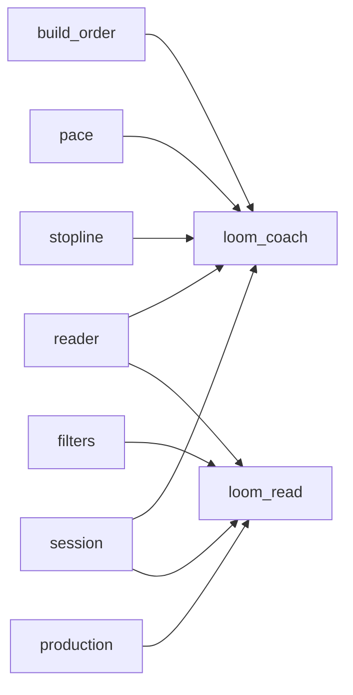

# How Loom fits together

A map of the code, kept honest by a test.

**Every arrow means "feeds".** `anchor --> reader` says anchor's output is
what reader works from — and `tools/architecture.py` checks the source
really does show `reader` importing `anchor`. A box that names no real
module fails. An arrow that names no real import fails. A module that
appears on no diagram fails.

So this map may **simplify** — `paths` is imported by nearly everything and
drawing it would bury the picture, so it is deliberately left out — but it
can never **lie**, and it can never quietly fall behind. Run
`python -m tools.architecture --check` to ask.

---

## 1. Reading the screen

Pixels in one end, a judged reading out the other. This is the layer where
every design rule about never guessing lives.

`anchor` finds the population icon and derives every other read region from
it, which is why almost nothing else needs to know a screen coordinate — and
why a pixel constant that does not scale with the anchor is a latent bug.

`glyphs` and `lines` point at each other on purpose. `glyphs` reads the
notification font letter by letter; `lines` holds the enumerated universe of
lines the game can print and snaps a wobbly reading onto the nearest real
one. Neither is complete alone.

`filters` is the gate that turns a reading into a belief, and `session`
decides whether this is the same game as last time.

## 2. From a reading to the panel

`loom_overlay` is the widest box on the map because it is the application:
it owns the poll loop and wires everything else together.

`checklist` is where OBSERVED and ASSUMED are kept apart — it takes
`build_order` for what a step expects and `glyphs` for what the game
actually announced, and never lets the second look like the first.

`follow` exists so the panel can say on its face when a hotkey has moved the
step by hand and it is no longer following the game.

## 3. The launcher and its children

The launcher never imports the applications. It spawns them, and talks to
them down a pipe.

`runner` is the seam: `entry` knows how to launch a child whether Loom is
frozen or running from source, `statefeed` carries the child's state up on
stdout, and `stopline` carries requests back down on stdin.

**`events` is the reconciler.** Its own docstring says it best — *"It is not
a pub/sub bus. A bus routes; this DECIDES."* It reconciles by **MAX, never
addition**, because its witnesses answer overlapping questions and adding
them would count one thing twice.

There are three witnesses now, and they do not answer the same question:

| witness | says | reaches events via |
|---|---|---|
| the production queue | what was **queued** — and never mentions buildings | `queue --> events` |
| the notification feed | what was **built** or **researched** | the readers, through `statsview` |
| the recorded game | what the player **ordered** | `replay --> statsview` |

That third one is why the table matters. The record says a building was
PLACED, the feed says it was BUILT, the queue says it was QUEUED: three
clocks on three different moments. A placement is not a rival reading of a
completion, so it can only ever be a **ceiling** — enough to convict a
reader that over-fires, never enough to convict one that under-fires. Used
the other way round, subtracted FROM a completion, it gives build duration,
which is what `durations` is for.

**Still a gap:** the live path does not go through `events`. It reconciles
after the game, from the stats file. The Town Centre decision the overlay
makes while you play is still a bare `max()` in `production.py`.

## 4. The two smaller applications

`loom_coach` is the build order in a terminal; `loom_read` is a live readout
of the two HUD numbers and nothing else. Both sit on the same `reader`, which
is what makes `reader` worth keeping free of anything Qt.
